第五届字节跳动青训营后端基础班大项目——极简版抖音

青训营后端项目 - 头发只多不少队伍文档

# 一、项目介绍

本项目系第五届字节跳动青训营后端基础班小组头发只多不少基于go语言所开发的极简版抖音。

服务地址：由于是在本地进行部署的，故无服务地址。下附本地演示的视频链接。

Github地址： https://github.com/CatKai94/Tiktok

# 二、项目分工

| **团队成员** | **主要贡献**                                                 |
| ------------ | ------------------------------------------------------------ |
| 钱宸（队长） | 负责构建项目结构，整合各分支代码负责用户模块(user)、视频模块(video)、关注模块(follow) |
| 朱俊哲       | 负责点赞模块(like)                                           |
| 王正         | 负责评论模块(comment)                                        |
| 王江龙       | 负责消息模块(message)                                        |
| 刘凤凯       | 负责文档整理、技术选型，github代码维护                       |

# 三、项目实现

### 3.1 技术选型

go：版本1.19.5

数据库：mysql8.0.30，存储项目的基本数据内容

gin：项目的web框架 gorm：连接项目和mysql数据库，使项目能对mysql内的数据进行增删改查

redis：在点赞，关注，消息的使用过程中，可以先将信息存储在redis中，快速将信息返回给前端，确保用户使用的流畅性。同时加入代码逻辑对mysql数据表进行维护，确保mysql表内的数据和redis中的数据一致，也方便其他操作可以通过查询mysql表来获得想要的准确数据。

ffmpeg：本地部署ffmpeg，由go语言的相关代码调用ffmpeg指令对用户提交上来的视频提取第一帧保存在项目的/public/images目录下，以作为视频封面。

sensitive.Filter：敏感词过滤器，在document文件夹下存储一个sensitiveDict.txt文件，项目启动时读取该文件中敏感词内容并初始化过滤器。发表评论前先对评论内容进行过滤，遇到敏感词时使用同等数量的“*”代替该敏感词。

JWT：本次项目也是按要求使用了JWT来传递token，并且能够解析token来提取用户信息

sha256加密：对用户的密码进行sha256算法加密，保障了用户的隐私安全

**静态资源存储**

通过`r.Static("/static", "./public")`将用户上传的视频资源存储在本地的/public/videos目录下；图片资源存储在本地的/public/images目录下

### 3.2 架构设计

借鉴了SpringBoot的经典三段式架构

由controller、models、service三部分构建项目的主干结构

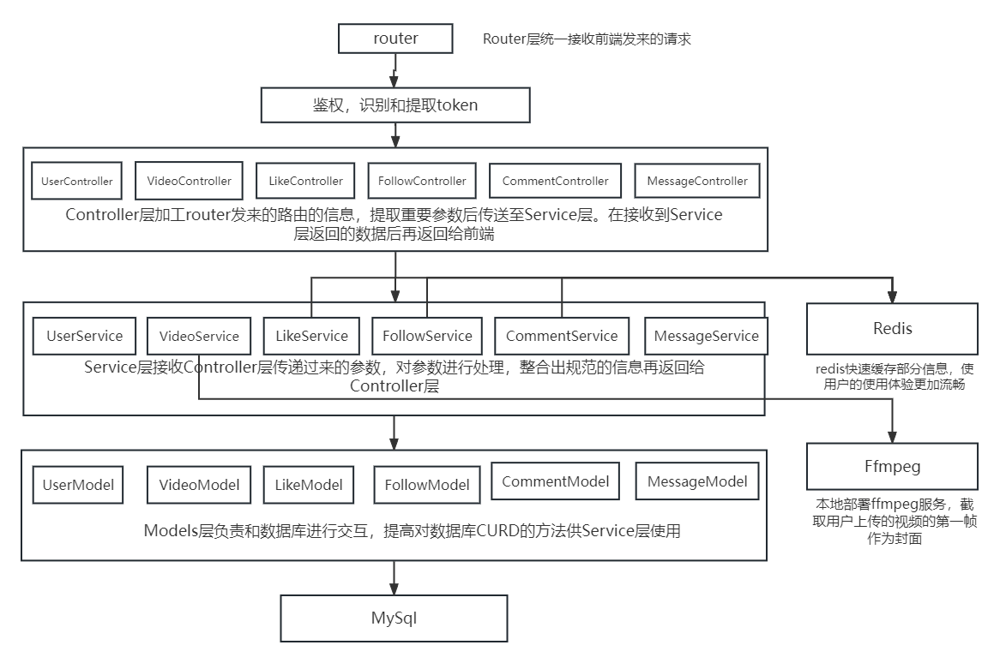

#### 3.2.1 Router层

负责统一接收前端的发来的路由请求，并将路由信息转发至相应的controller层的函数中

#### 3.2.2 Controller层

controller层负责提取传进来的路由中所包含的信息，如用户id，账号、密码、token之类。然后整理需要的关键参数，送至service层中进行信息整合，最后返回给前端。

#### 3.2.3 Models层

models层负责构建数据库对应表相应字段的结构体，然后统一映射至指定的mysql数据库表中。并且models层内还负责对该mysql表的CURD操作同时提供函数供service层使用来操作数据库。

#### 3.2.4 Service层

负责整合controller中所传进来的参数。根据业务需要对数据进行增删改查、并包装成指定的结构体格式返回数据至controller层，再由controller层返回给前端。

### 3.3 数据库设计

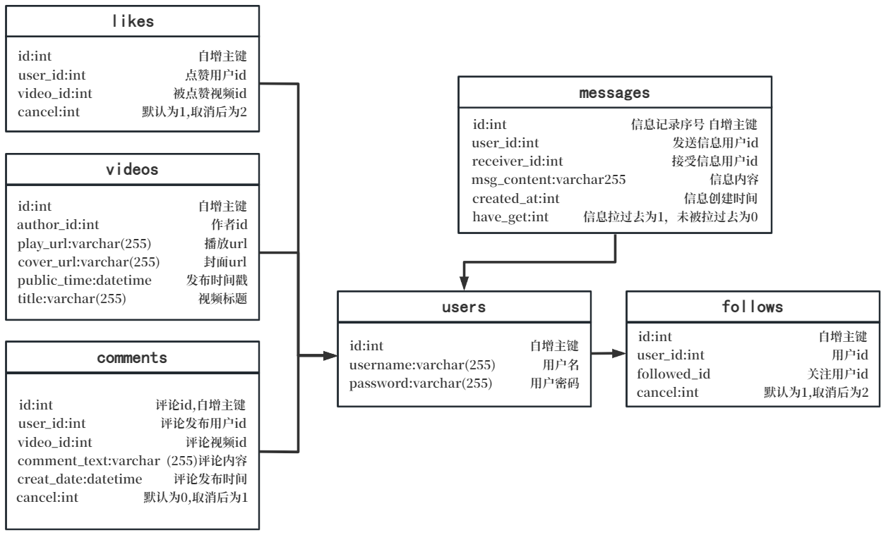

### 3.4 redis设计

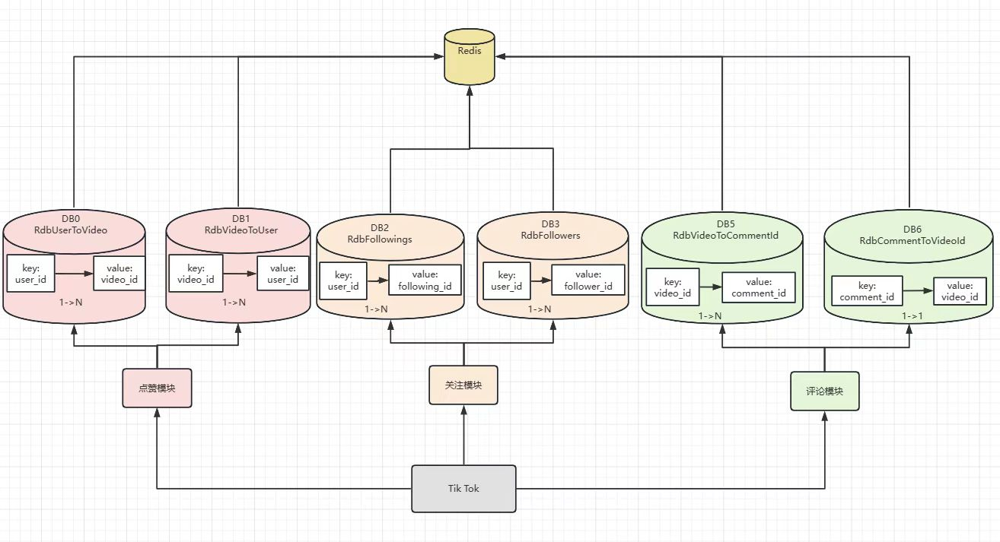

#### 3.4.1 点赞模块

RdbUserToVideo 

- key：当前用户id
- value：当前用户点赞的视频的id

RdbVideoToUser 

- key：视频id
- value：点赞了当前视频的用户的id

#### 3.4.2 关注模块

RdbFollowings 

- key：当前用户 id
- value：当前用户关注的用户的id

RdbFollowers  

- key：当前用户id
- value：当前用户的粉丝的id


#### 3.4.3 评论模块

RdbVideoToCommentId 

- key：视频的id
- value：视频下的评论的id 

RdbCommentToVideoId 

- key：评论id
- value：该评论所属的视频的id

### 3.5 项目代码介绍

#### 3.5.1 用户模块 user

##### 3.5.1.1 UserModel

```Go
// 映射字段名
type User struct {
   Id       int64
   Username string
   Password string
}

// 表名映射
func (u User) TableName() string {
   return "users"
}
```

对数据库操作的方法

```Go
// GetUserList 获取全部User对象
func GetUserList() ([]User, error) 

// GetUserByUsername 根据username获得User对象
func GetUserByUsername(name string) (User, error) 

// GetUserById 根据user_id获得User对象
func GetUserById(id int64) (User, error)

// InsertUser 将user插入表内
func InsertUser(user *User) bool 
```

##### 3.5.1.2 UserController

路由对应的函数

```Go
// Register douyin/user/register/ POST
// 用户注册
func Register(c *gin.Context) 

// Login POST /douyin/user/login/
// 用户登录
func Login(c *gin.Context) 

// UserInfo GET /douyin/user/
// 获取用户信息
func UserInfo(c *gin.Context) 
```

返回的信息格式

```Go
type Response struct {
   StatusCode int32  `json:"status_code"`
   StatusMsg  string `json:"status_msg,omitempty"`
}

type UserLoginResponse struct {
   Response
   UserId int64  `json:"user_id,omitempty"`
   Token  string `json:"token"`
}

type UserResponse struct {
   Response
   User service.FmtUser `json:"user"`
}
```

##### 3.5.1.3 UserService

需要包装的格式化信息

```Go
// FmtUser 最终封装后,controller返回的FmtUser结构体
type FmtUser struct {
   Id              int64  `json:"id,omitempty"`
   Name            string `json:"name,omitempty"`
   FollowCount     int64  `json:"follow_count"`
   FollowerCount   int64  `json:"follower_count"`
   IsFollow        bool   `json:"is_follow"`
   Avatar          string `json:"avatar,omitempty"`
   BackgroundImage string `json:"background_image,omitempty"`
   Signature       string `json:"signature,omitempty"`
   TotalFavorited  int64  `json:"total_favorited,omitempty"`
   WorkCount       int64  `json:"work_count,omitempty"`
   FavoriteCount   int64  `json:"favorite_count,omitempty"`
}
```

接口

```Go
type UserService interface {
   // GetUserList 获得全部User对象
   GetUserList() []models.User
   // GetUserByUsername 根据username获得User对象
   GetUserByUsername(name string) models.User
   // InsertUser 将user插入表内
   InsertUser(user *models.User) bool
   // GetFmtUserById 未登录情况下,根据user_id获得User对象
   GetFmtUserById(id int64) (FmtUser, error)
   // GetFmtUserByIdWithCurId 已登录(curID)情况下,根据user_id获得User对象
   GetFmtUserByIdWithCurId(id int64, curId int64) (FmtUser, error)
}
```

方法实现

```Go
// 获取用户列表
func (usi *UserServiceImpl) GetUserList() []models.User

// 根据username获取表内的User信息
func (usi *UserServiceImpl) GetUserByUsername(username string) models.User 

// InsertUser 将tableUser插入表内
func (usi *UserServiceImpl) InsertUser(user *models.User) bool 

// GetFmtUserById 未登录情况下,根据user_id获得User对象
func (usi *UserServiceImpl) GetFmtUserById(id int64) (FmtUser, error)

// GetFmtUserByIdWithCurId 已登录(curID)情况下,根据user_id获得User对象
func (usi *UserServiceImpl) GetFmtUserByIdWithCurId(id int64, curId int64) (FmtUser, error) 

// GenerateToken 根据username生成一个token
func GenerateToken(username string) string

// NewToken 根据用户信息创建token
func NewToken(user models.User) string

// EnCoder 通过sha256密码加密
func EnCoder(password string) string 
```

#### 3.5.2 视频模块 video

##### 3.5.2.1 VideoModel

```Go
// 映射字段名
type Video struct {
   Id          int64 `json:"id"`
   AuthorId    int64
   PlayUrl     string `json:"play_url"`
   CoverUrl    string `json:"cover_url"`
   PublishTime time.Time
   Title       string `json:"title"`
}

// 表名映射
func (Video) TableName() string {
   return "videos"
}
```

对数据库操作的方法

```Go
// 依据一个时间，来获取这个时间之前的一些视频
func GetVideosByLastTime(lastTime time.Time)

// 根据作者的id来查询对应数据库数据，返回Video切片
func GetVideosByAuthorId(authorId int64) ([]Video, error) 

// 依据VideoId来获得视频信息
func GetVideoByVideoId(videoId int64) (Video, error) 

// InsertVideo 保存视频记录
func InsertVideo (videoName string, imageName string, authorId int64, title string) error

// 通过作者id来查询发布的视频id切片集合
func GetVideoIdsByUserId (authorId int64) ([]int64, error) 
```

##### 3.5.2.2 VideoController

路由对应的函数

```Go
// Feed /feed/  获取feed流
func Feed(c *gin.Context) 

// PublishAction /publish/action/ 发布视频
func PublishAction(c *gin.Context) 

// PublishList /publish/list/ 获取发布视频列表
func PublishList(c *gin.Context)
```

返回的格式化信息

```Go
type Response struct {
   StatusCode int32  `json:"status_code"`
   StatusMsg  string `json:"status_msg,omitempty"`
}

type FeedResponse struct {
   Response
   VideoList []service.FmtVideo `json:"video_list"`
   NextTime  int64              `json:"next_time"`
}

type PublishListResponse struct {
   Response
   VideoList []service.FmtVideo `json:"video_list"`
}
```

##### 3.5.3.3 VideoService

需要包装的格式化信息

```Go
type FmtVideo struct {
   models.Video
   Author        FmtUser `json:"author"`
   FavoriteCount int64   `json:"favorite_count"`
   CommentCount  int64   `json:"comment_count"`
   IsFavorite    bool    `json:"is_favorite"`
}
```

接口

```Go
type VideoService interface {
   // Feed 通过传入时间戳，当前用户的id，返回对应的视频切片数组，以及视频数组中最早的发布时间
   Feed(lastTime time.Time, userId int64) ([]FmtVideo, time.Time, error)
   // GetVideo 传入视频id获得对应的视频对象
   GetVideo(videoId int64, userId int64) (FmtVideo, error)
   // PublishAction 将传入的视频流保存在文件服务器中，并存储在mysql表中
   PublishAction(data *multipart.FileHeader, userId int64, title string) error
   // GetVideoList 通过userId来查询对应用户发布的视频，并返回对应的视频切片数组
   GetVideoList(userId int64, curId int64) ([]FmtVideo, error)
}
```

方法实现

```Go
// Feed
// 通过传入时间戳，当前用户的id，返回对应的视频数组，以及视频数组中最早的发布时间
// 获取视频数组大小是可以控制的，在config中的videoCount变量
func (vsi *VideoServiceImpl) Feed(lastTime time.Time, userId int64) ([]FmtVideo, time.Time, error) 

// GetVideo
// 传入视频id获得对应的视频对象，注意还需要传入当前登录用户id
func (vsi *VideoServiceImpl) GetVideo(videoId int64, userId int64) (FmtVideo, error)

// 发布视频
func (vsi *VideoServiceImpl) Publish(fileName string, userId int64, title string) error

func (vsi *VideoServiceImpl) GetVideoList(userId int64, curId int64) ([]FmtVideo, error) 

// 将Video格式化为fmtVideo
func (vsi *VideoServiceImpl) refactorVideos(result *[]FmtVideo, data *[]models.Video, userId int64) error

// 将fmtVideo进行组装，添加想要的信息,插入从数据库中查到的数据
func (vsi *VideoServiceImpl) creatFmtVideo(fmtVideo *FmtVideo, video *models.Video, userId int64)

// GetFmtVideo 通过视频id获得FmtVideo对象
func (vsi *VideoServiceImpl) GetFmtVideo(videoId int64, userId int64) (FmtVideo, error)

// 根据用户id获取用户的视频总数
func (vsi *VideoServiceImpl) GetVideoCntByUserId(userId int64) int64 
```

#### 3.5.3 点赞模块 like

##### **1.models.like**

定义数据库表对应如下：

```undefined
type Like struct {
   Id      int64 //自增主键
   UserId  int64 //点赞用户id
   VideoId int64 //视频id
   Cancel  int8  //是否点赞，1为点赞，2为取消赞
}
```

除此之外，定义如下5个方法用于相关数据库操作:

```Go
// AddLike 添加点赞数据
func AddLike(userId int64, videoId int64) error

// QueryLikeInfo 根据usrId,videoId查询具体的一条点赞信息
func QueryLikeInfo(userId int64, videoId int64) (Like, error)

// GetVideoIdList GetVideoList 根据userId,查询该用户点赞过的全部videoId
func GetVideoIdList(userId int64) ([]int64, error) 

// GetUserIdList 根据videoId查询所有点赞过该视频的用户userId
func GetUserIdList(videoId int64) ([]int64, error) 

// UpdateLikeAction 根据userId,videoId,actionType修改用户点赞的状态
func UpdateLikeAction(userId int64, videoId int64, actionType int32) error
```

- ##### **2.service.like**

-  service.likeService(interface)定义了6个方法，用于为controller层传输数据以及其他模块的业务逻辑。

-  均在service.likeServiceImpl中具体实现

- ```Go
  // JudgeUserIsLike  根据当前视频id判断当前用户是否点赞了该视频。
  func JudgeUserIsLike(videoId int64, userId int64) (bool, error)
  
  // GetLikeCount  根据当前视频id获取当前视频点赞数量。
  func GetLikeCount(videoId int64) (int64, error)
  
  // GetUserTotalIsLikedCount 根据userId获取这个用户总共被点赞数量
  func GetUserTotalIsLikedCount(userId int64) (int64, error)
  
  // GetLikeVideoCount  根据userId获取这个用户点赞视频数量
  func GetLikeVideoCount(userId int64) (int64, error)
  
  // LikeAction 当前用户对视频的点赞操作 ,并把这个行为更新到like表中。
  //当前操作行为，1点赞，2取消点赞。
  func LikeAction(userId int64, videoId int64, actionType int32) error
  
  // GetLikeVideoList 获取当前用户的所有点赞视频，调用videoService的方法
  func GetLikeVideoList(userId int64, curId int64) ([]FmtVideo, error)
  ```

##### **3.controller.LikeController**

LikeController中定义了返回给前端的结构体，分别对应两个接口：

```Go
// LikeActionResponse 进行点赞或取消赞的操作时返回的结构体
type LikeActionResponse struct {
   StatusCode int32  `json:"status_code"`
   StatusMsg  string `json:"status_msg"`
}

// LikeListResponse 进行查询用户喜欢视频列表时返回的结构体
type LikeListResponse struct {
   StatusCode int32              `json:"status_code"`
   StatusMsg  string             `json:"status_msg"`
   VideoList  []service.FmtVideo `json:"video_list"`
}
```

对应的两个接口：

```Go
// LikeAction  /favorite/action/ - 赞或取消赞操作
func LikeAction(c *gin.Context)

// GetLikeVideoList /favorite/list/ - 查询用户的喜欢视频列表
func GetLikeVideoList(c *gin.Context)
```

#### 3.5.4 关注模块 follow

##### 3.5.4.1 FollowModel

```Go
// Follow 用户关系结构，对应用户关系表。
type Follow struct {
   Id         int64
   UserId     int64
   FollowerId int64
   Cancel     int8
}

// TableName 设置Follow结构体对应数据库表名。
func (Follow) TableName() string {
   return "follows"
}
```

对数据库操作的方法

```Go
// QueryFollowInfo 给定当前用户和目标用户id，查询follow表中相应的记录。
func QueryFollowInfo(userId int64, curId int64) (Follow, error)

// QueryEverFollowInfo 查询是否有曾经关注过的信息
func QueryEverFollowInfo(userId int64, curId int64) (Follow, error) 

// InsertFollowRelation 给定当前用户和目标对象id，插入其关注关系。  当前用户关注目标用户
func InsertFollowRelation(userId int64, curId int64) error

// GetFollowingsId 给定用户id，查询该用户所有关注者的id。
func GetFollowingsId(userId int64) ([]int64, error)

// GetFollowersId 给定用户id，查询该用户所有的粉丝id
func GetFollowersId(userId int64) ([]int64, error) 

// UpdateFollowRelation 给定用户和目标用户的id，更新他们的关系为取消关注或再次关注。
func UpdateFollowRelation(userId int64, targetId int64, cancel int8) error
```

##### 3.5.4.2 FollowController

路由对应的函数

```Go
// RelationAction /relation/action/ - 关系操作
// 登录用户对其他用户进行关注或取消关注。
func RelationAction(c *gin.Context) 

// GetFollowingList /relation/follow/list/ - 用户关注列表
// 登录用户关注的所有用户列表。
func GetFollowingList(c *gin.Context) 

// GetFollowerList /relation/follower/list/ - 用户粉丝列表
// 所有关注登录用户的粉丝列表。
func GetFollowerList(c *gin.Context)

// GetFriendList /relation/friend/list/ - 用户好友列表
// 所有和用户互关的粉丝列表
func GetFriendList(c *gin.Context) 
```

返回的格式化信息

```Go
type Response struct {
   StatusCode int32  `json:"status_code"`
   StatusMsg  string `json:"status_msg,omitempty"`
}

// FollowingResp 获取关注列表需要返回的结构。
type FollowingResp struct {
   Response
   UserList []service.FmtUser `json:"user_list,omitempty"`
}

// FollowersResp 获取粉丝列表需要返回的结构。
type FollowersResp struct {
   Response
   UserList []service.FmtUser `json:"user_list,omitempty"`
}

type FriendResp struct {
   Response
   FriendList []service.FmtFriend `json:"user_list"`
}
```

##### 3.5.4.3 FollerService

需要包装的格式化信息

```Go
// FmtUser 最终封装后,controller返回的FmtUser结构体
type FmtUser struct {
   Id              int64  `json:"id,omitempty"`
   Name            string `json:"name,omitempty"`
   FollowCount     int64  `json:"follow_count"`
   FollowerCount   int64  `json:"follower_count"`
   IsFollow        bool   `json:"is_follow"`
   Avatar          string `json:"avatar,omitempty"`
   BackgroundImage string `json:"background_image,omitempty"`
   Signature       string `json:"signature,omitempty"`
   TotalFavorited  int64  `json:"total_favorited,omitempty"`
   WorkCount       int64  `json:"work_count,omitempty"`
   FavoriteCount   int64  `json:"favorite_count,omitempty"`
}

// FmtFriend 格式化的好友列表
type FmtFriend struct {
   FmtUser
   Message string `json:"message,omitempty"`
   MsgType int64  `json:"msgType"`
}
```

接口

```Go
type FollowService interface {
   // IsFollowing 根据当前用户id和目标用户id来判断当前用户是否关注了目标用户
   IsFollowing(userId int64, curId int64) (bool, error)
   // GetTotalFollowersCnt 根据用户id查询粉丝数量
   GetTotalFollowersCnt(userId int64) (int64, error)
   // GetTotalFollowingsCnt 根据用户id查询该用户的关注数量
   GetTotalFollowingsCnt(userId int64) (int64, error)
   // FollowAction 当前用户关注目标用户 操作
   FollowAction(userId int64, curId int64) (bool, error)
   // UnFollowAction 当前用户取消对目标用户的关注 操作
   UnFollowAction(userId int64, curId int64) (bool, error)
   // GetFollowingsList 获取当前用户的关注列表
   GetFollowingsList(userId int64) ([]FmtUser, error)
   // GetFollowersList 获取当前用户的粉丝列表
   GetFollowersList(userId int64) ([]FmtUser, error)
}
```

方法实现

```Go
// IsFollowing 当前用户是否关注了目标用户
func (fsi *FollowServiceImp) IsFollowing(userId int64, curId int64) (bool, error)

// GetTotalFollowersCnt 给定用户id，查询其粉丝数量。
func (fsi *FollowServiceImp) GetTotalFollowersCnt(userId int64) int64

// GetTotalFollowingsCnt 给定当前用户id，查询该用户的关注总数量。
func (fsi *FollowServiceImp) GetTotalFollowingsCnt(userId int64) int64 

// FollowAction 当前用户关注目标用户
func (fsi *FollowServiceImp) FollowAction(userId int64, curId int64) error

// UnFollowAction 当前用户取消关注目标用户
func (fsi *FollowServiceImp) UnFollowAction(userId int64, curId int64) error 

// GetFollowingsList 查询目标用户的关注列表
func (fsi *FollowServiceImp) GetFollowingsList(userId int64) ([]FmtUser, error)

// GetFollowersList 查询用户的粉丝列表
func (fsi *FollowServiceImp) GetFollowersList(userId int64) ([]FmtUser, error)

// GetFollowersIdList 为下面获取好友列表服务
func (fsi *FollowServiceImp) GetFollowersIdList(userId int64) ([]int64, error) 

// 获取好友列表
func (fsi *FollowServiceImp) GetFriendList(userId int64) ([]FmtFriend, error)
```

#### 3.5.5 评论模块 comment

##### 3.5.5.1、CommentModels

定义comment结构体映射数据库表：

```Go
// Comment
// 评论信息-数据库中的结构体-dao层使用
type Comment struct {
   Id          int64     //评论id
   UserId      int64     //评论用户id
   VideoId     int64     //视频id
   CommentText string    //评论内容
   CreateDate  time.Time //评论发布的日期mm-dd
   Cancel      int32     //取消评论为1，发布评论为0
}

// TableName 修改表名映射
func (Comment) TableName() string {
   return "comments"
}
```

实现的对数据库操作的方法:

```Go
// Count
// 1、使用video id 查询Comment数量
func Count(videoId int64) (int64, error) 

// CommentIdList 根据视频id获取评论id 列表
func CommentIdList(videoId int64) ([]string, error) 

// InsertComment
// 2、发表评论
func InsertComment(comment Comment) (Comment, error) 

// DeleteComment
// 3、删除评论，传入评论id
func DeleteComment(id int64) error 

// GetCommentList
// 4.根据视频id查询所属评论全部列表信息
func GetCommentList(videoId int64) ([]Comment, error) 
```

##### 3.5.5.2、CommentService

service.commentService接口定义了4个方法，用于为controller层传输数据完成对评论的操作，均在service.commentServiceImpl中具体实现：

接口：

```Go
// CountFromVideoId 根据videoId获取视频评论数量的接口
CountFromVideoId(videoId int64) (int64, error)

// SendComment 发送评论
SendComment(comment models.Comment) (CommentInfo, error)

// DeleteComment 删除评论
DeleteComment(commentId int64) error

// GetCommentsList 获取视频的所有评论
GetCommentsList(videoId int64, userId int64) ([]CommentInfo, error)
```

方法实现：

```Go
type CommentServiceImpl struct {
   UserService
}

// CountFromVideoId 根据videoId获取视频评论数量
func  CountFromVideoId(videoId int64) (int64, error) 

// SendComment 发送评论
func  SendComment(comment models.Comment) (CommentInfo, error) 

// DeleteComment 删除评论
func  DeleteComment(commentId int64) error 

// GetCommentsList 获取视频的所有评论
func  GetCommentsList(videoId int64, userId int64) ([]CommentInfo, error) 

// 在redis中存储video_id对应的comment_id 、 comment_id对应的video_id
func insertRedisVideoCommentId(videoId string, commentId string) 

// CommentSlice 此变量以及以下三个函数都是做排序-准备工作
type CommentSlice []CommentInfo

func (a CommentSlice) Len() int { // 重写Len()方法
   return len(a)
}
func (a CommentSlice) Swap(i, j int) { // 重写Swap()方法
   a[i], a[j] = a[j], a[i]
}
func (a CommentSlice) Less(i, j int) bool { // 重写Less()方法
   return a[i].CommentId > a[j].CommentId
}
```

##### 3.5.5.3、CommenController

定义的CommentAction()函数返回的CommentActionResponse 结构体和CommentList()函数返回的CommentListResponse 结构体：

```Go
// CommentListResponse
// 评论列表返回参数
type CommentListResponse struct {
   StatusCode  int32                 `json:"status_code"`
   StatusMsg   string                `json:"status_msg,omitempty"`
   CommentList []service.CommentInfo `json:"comment_list,omitempty"`
}

// CommentActionResponse
// 发表评论返回参数
type CommentActionResponse struct {
   StatusCode int32               `json:"status_code"`
   StatusMsg  string              `json:"status_msg,omitempty"`
   Comment    service.CommentInfo `json:"comment"`
}
```

实现的路由方法：

```Go
// CommentAction /comment/action/ - 评论操作
// 登录用户对视频进行评论。
func CommentAction(c *gin.Context) 

// CommentList /comment/list/ - 视频评论列表
// 查看视频的所有评论，按发布时间倒序。
func CommentList(c *gin.Context) 
```

#### 3.5.6 消息模块 message

##### 1.models

定义的Message结构体，与数据库中的Message表相对应

```Go
type Message struct {
   Id         int64  `json:"id" gorm:"id"`
   UserId     int64  `json:"user_id" gorm:"user_id"`
   ReceiverId int64  `json:"receiver_id" gorm:"receiver_id"`
   MsgContent string `json:"msg_content" gorm:"msg_content"`
   CreatedAt int64 `json:"created_at" gorm:"created_at"`
   HaveGet   int64 `gorm:"have_get"`
}
```

实现的方法

SendMessage接受service层传进来的数据，然后调用SaveMessage存储到数据库中

```Go
// SendMessage fromUserId 发送消息 content 给 toUserId
func SendMessage(fromUserId int64, toUserId int64, content string) error 
// SaveMessage 
func SaveMessage(msg Message) error
```

MessageChat查询数据库中的信息记录，如果查询成功，调用DeleteMessage进行逻辑删除

```Go
// MessageChat 当前登录用户和其他指定用户的聊天记录
func MessageChat(loginUserId int64, targetUserId int64) ([]Message, error) 
// DeleteMessage 将已经拉取过的信息逻辑删除
func DeleteMessage(loginUserId int64, targetUserId int64) 
// LatestMessage 返回 loginUserId 和 targetUserId 最近的一条聊天记录
func LatestMessage(loginUserId int64, targetUserId int64) (Message, error) 
```

##### 2.service

定义的service层的Message和LatestMessage结构体

```Go
type Message struct {
   Id         int64  `json:"id"`
   UserId     int64  `json:"from_user_id"`
   ReceiverId int64  `json:"to_user_id"`
   MsgContent string `json:"content"`
   CreatedAt  int64  `json:"create_time" db:"created_at"`
}
type LatestMessage struct {
   message string `json:"message"`
   msgType int64  `json:"msg_type"`
}
```

实现的方法

```Go
// ActionMessage 发送消息，即向数据库中保存消息
func ActionMessage(fromUserId int64, toUserId int64, content string) error

// MessageChat 用来查询数据库中的消息记录，
func MessageChat(loginUserId int64, targetUserId int64) ([]Message, error)

// getRespMessage 将数据库Db中的message映射为要返回的message结构体
func getRespMessage(messages *[]Message, plainMessages *[]models.Message) error

// LatestMessage 返回两个 loginUserId 和好友 targetUserId 最近的一条聊天记录
func LatestMessage(loginUserId int64, targetUserId int64) (LatestMessage, error)
```

##### 3.controller

定义的MessageChat()函数返回的ChatResponse结构体

```Go
type ChatResponse struct {
   Response
   MessageList []service.Message `json:"message_list"`
}
```

实现的方法

```Go
//MessageAction 实现了信息的发送功能，及调用service层的ActionMessage进行信息的存储
func MessageAction()

//MessageChat 实现了查询登录用户为接受方的信息
func MessageChat()
```

# 四、测试结果

## **4.1 功能测试：**

### 4.1.1 用户模块

#### 用户注册

注册功能使用正常

| 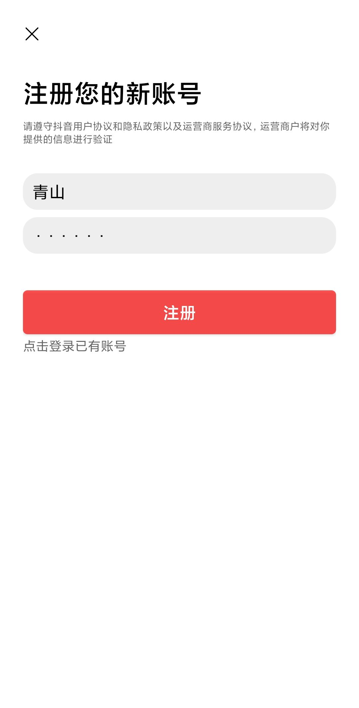 | 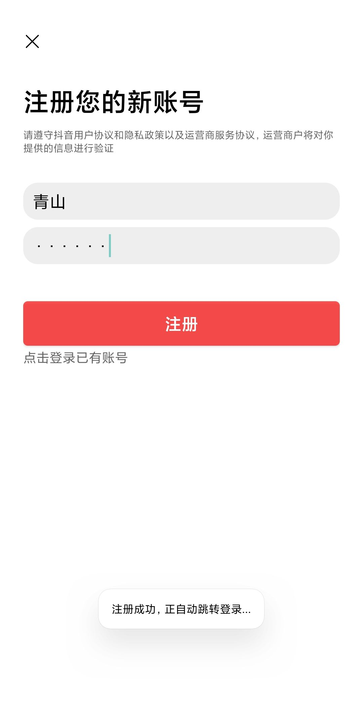 | 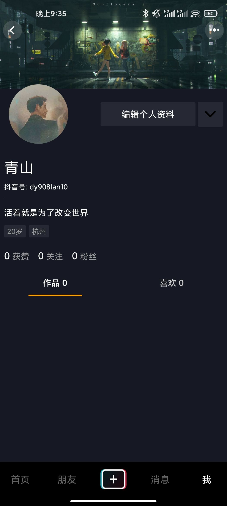 |
| ---------------------------------- | ---------------------------------- | ---------------------------------- |
|                                    |                                    |                                    |

#### 用户登录

登录功能使用正常

| 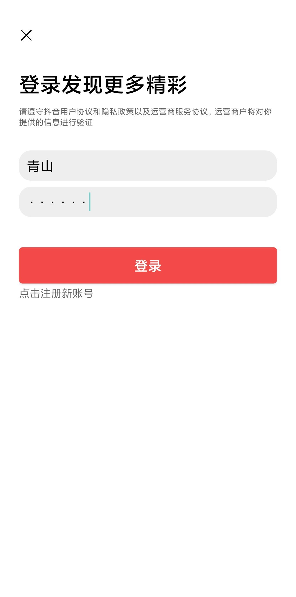 | 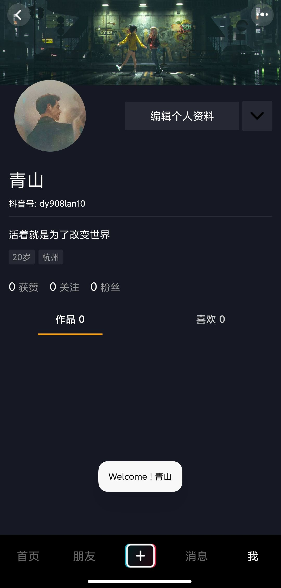 |
| ---------------------------------- | ---------------------------------- |
|                                    |                                    |

### 4.1.2 视频模块

接收视频、发布视频功能正常

|  |  | 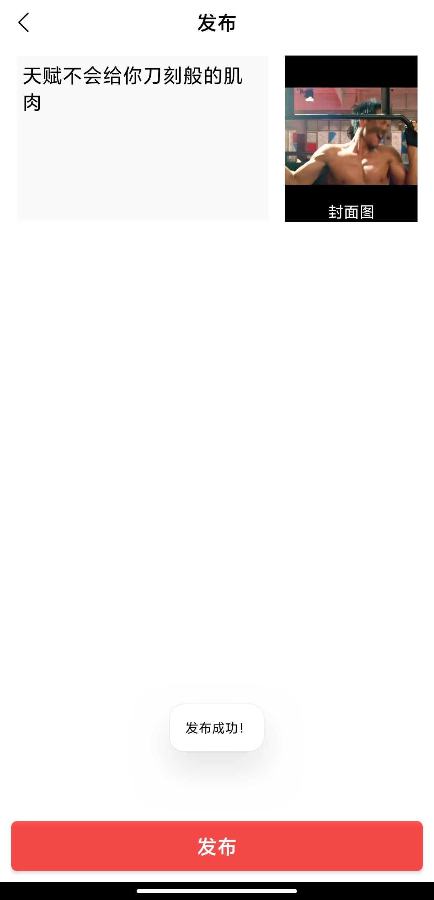 |  |
| ---------------------------------- | ---------------------------------- | ----------------------------------- | ----------------------------------- |
|                                    |                                    |                                     |                                     |

### 4.1.3 点赞模块

点赞和取消点赞正常

|  |  |
| ----------------------------------- | ----------------------------------- |
|                                     |                                     |

### 4.1.3 关注模块

关注、取消关注功能正常

|  |  |  |  |
| ----------------------------------- | ----------------------------------- | ----------------------------------- | ----------------------------------- |
|                                     |                                     |                                     |                                     |

### 4.1.4 评论模块

#### 发表评论

发表评论功能正常

| 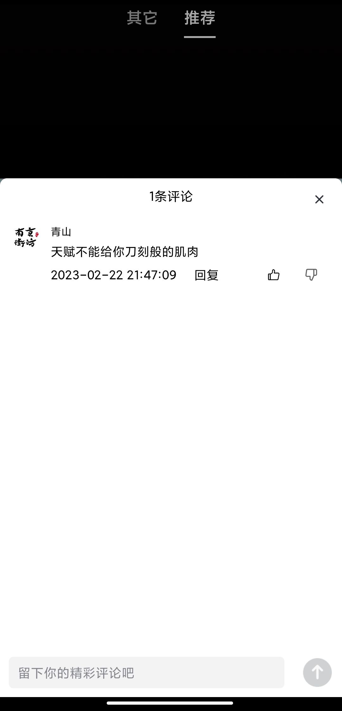 | 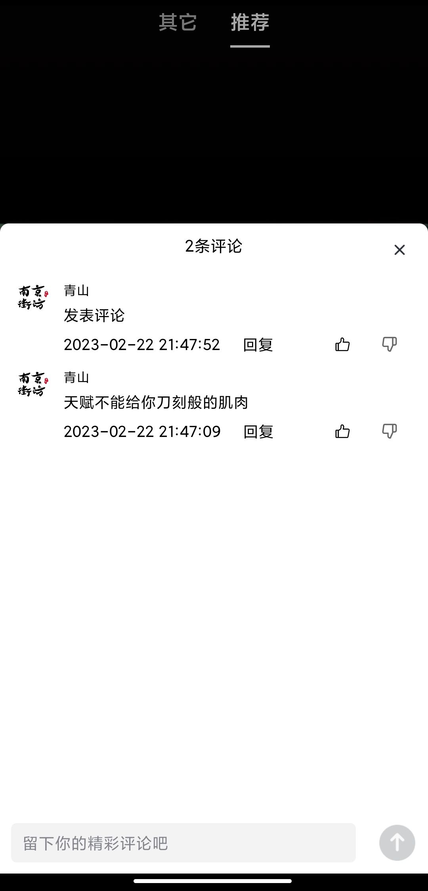 |
| ----------------------------------- | ----------------------------------- |
|                                     |                                     |

#### 删除评论

删除评论正常

| 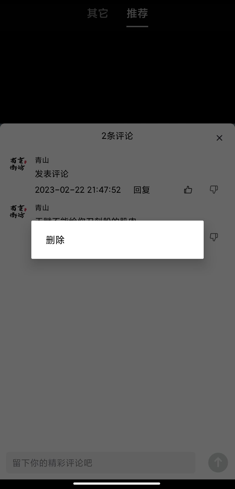 | 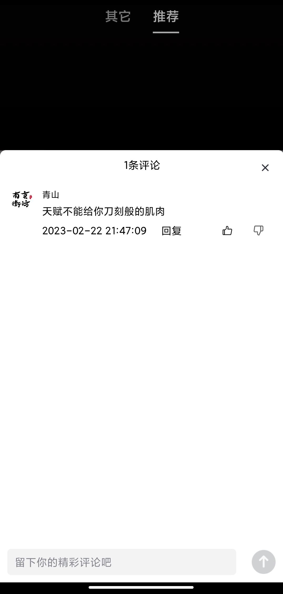 |
| ----------------------------------- | ----------------------------------- |
|                                     |                                     |

### 4.1.5 消息模块

登录账号"青山"发送消息

|  |  |
| ----------------------------------- | ----------------------------------- |
|                                     |                                     |

登录账号"辛弃疾"接收消息

| 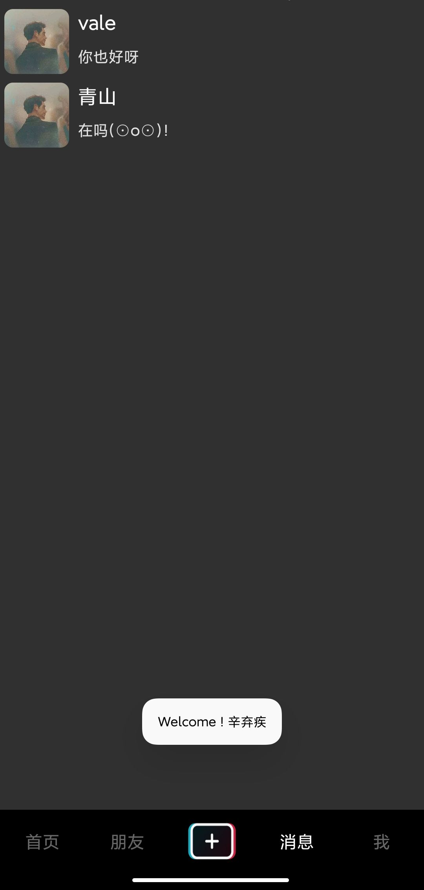 |  |
| ----------------------------------- | ----------------------------------- |
|                                     |                                     |

消息模块正常

## **4.2 性能测试**

pprof测试cpu使用率火焰图

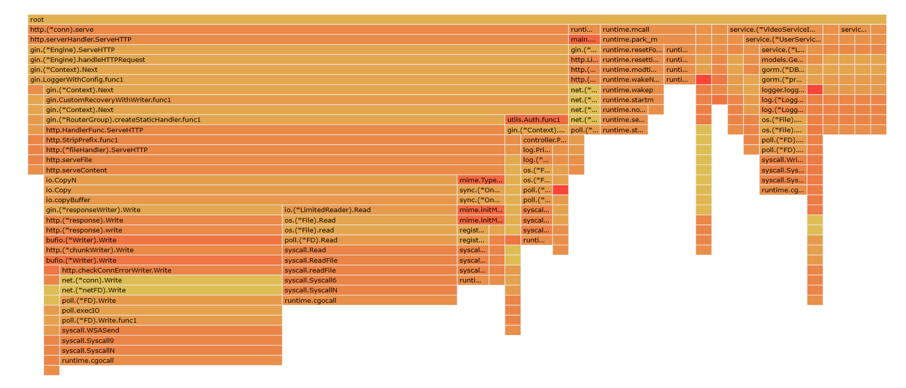

# 五、Demo 演示视频 （必填）

暂时无法在飞书文档外展示此内容

# 六、项目总结与反思

## 6.1 存在的问题

1. 静态资源存储在本地，当文件数量过大时必然会和本地所部署的服务竞争资源
2. 项目面对小规模的使用可以负载，但当访问量过大时就会出现大量访问同时竞争资源的场面从而破坏服务。项目整体面对高并发场景的处理能力弱

## 6.2 已识别的优化项

前期项目完全基于对mysql表的查询来处理业务，明显的缺陷是在点赞、关注等，需要服务立刻反馈信息给用户的场景，却因要等待mysql进行curd，而导致了一小段的延迟。这很大程度上影响了用户的使用体验。为此我们小组对点赞，关注，评论功能加入了redis缓存，通过redis的快速缓存能够迅速反馈结果给用户，从而极大程度上提高了用户的体验感。

## 6.3 架构演进的可能性

未来考虑对项目整体进行解耦，通过grpc来完成分布式服务，提高项目的整体运行和负载能力

## 6.4 项目总结

​       团队成员均有过SpringBoot项目开发经验，对于本次青训营项目也是在参考了前几届学员的项目后摸索出来的开发路线，所以代码逻辑可能略显稚嫩。通过本次青训营项目，我们掌握了go语言的基本语法知识，熟悉了gin+gorm框架开发项目的流程，尝试并成功使用了go语言框架驱动redis和本地的ffmpeg工具来辅助开发。

​       关于团队合作方面，我们小组内部均是第一次使用git合作管理项目，较之与以前个人独自管理，多人协作管理git对我们来说是一个麻烦。不过由于项目模块分明，所以我们采用了统一构建项目架构之后，每个成员只负责自己模块所对应的contollrt, models, service部分代码的编写，最终由组长统一合并的方式达到了团队协作开发项目的效果。

本次团队合作很顺利，队员间都能及时完成任务，并且相互间如果有要相互调用的函数方法也会沟通好，确保了项目开发的顺利。

## 反思

1. 项目部署情况，未来考虑使用nginx和更具安全性的https对项目进行代理。
2. 面对高并发场景，我们的项目就显得不堪重负。未来会加入消息队列，对项目各模块间进行解耦，提高项目应对高并发场景的负载能力。
3. 存储方面，用户上传的视频图片资源均是存放在本地的。如果数据量过大必然会占用本地的服务资源，未来会加入云obs服务，将这些静态资源存放在云obs服务器中从而减少本地的存储负担。
4. 代码编写方面，对于git的使用还是不够，没有充分利用好git的分支合并和版本回滚功能。在以后的团队合作中我们会更加注重这一点，训练自己熟悉对项目各代版本之间的整理与迭代

# 七、其他补充资料（选填）

无
